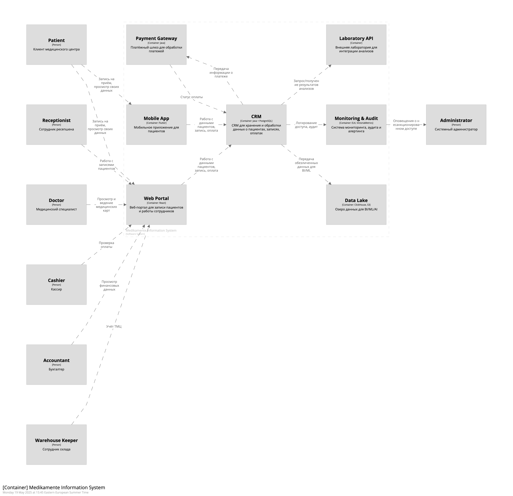

# ЗАДАНИЕ 2

---

## Усиление Data Privacy

- **CRM**
- Шифрование данных на уровне БД (PII, медицинские данные)
- Тегирование и разграничение доступа по ролям (RBAC/ABAC)
- Автоматическое удаление данных по запросу клиента
- Обезличивание данных для BI/ML

## Описание хранения и защиты данных

**CRM**
- Все чувствительные данные (PII, медицинские) хранятся в зашифрованном виде.
- Доступ к данным реализован по ролям (RBAC/ABAC).
- Данные тегируются по категориям чувствительности.
- Данные удаляются автоматически по истечении срока хранения или по запросу клиента.
- Для BI/ML используются только обезличенные данные.
- Все действия с данными логируются и доступны для аудита.

**Платёжный шлюз**
- Платёжные данные не хранятся, только статусы транзакций.
- Передача данных между CRM и шлюзом по защищённому каналу (TLS).

**Мониторинг и аудит**
- Все события доступа к данным фиксируются.
- В случае подозрительных действий отправляются алерты администратору.

**Примечание:**
Вся архитектура спроектирована с учётом требований по безопасности, масштабируемости и удобству сопровождения.
Для BI/ML используются только обезличенные данные, а доступ к чувствительной информации строго контролируется.